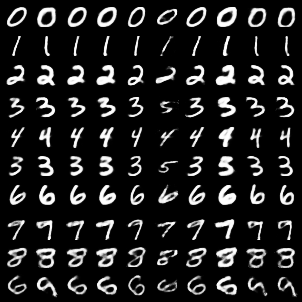
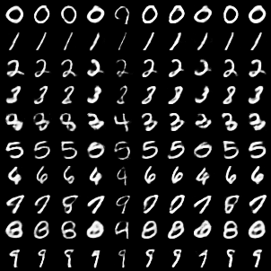
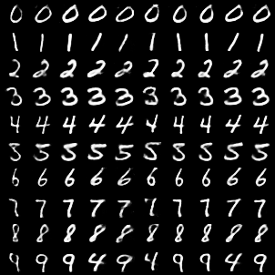
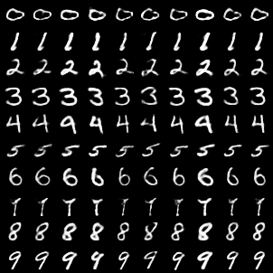
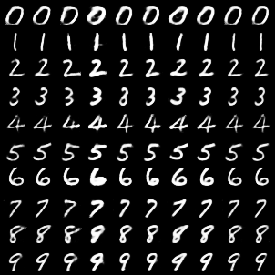

# adversarial-disentanglement
Use Adversarial Autoencoder just for disentanglement, with no arbitrary prior.

## Method
1. Make patchworked Z' from several independent samples of the Encoder's output Z.
```
z1 = {z1a, z1b} = Encoder(x1)
z2 = {z2a, z2b} = Encoder(x2)
z'1 = {z1a, z2b}
```

2. Let the Discriminator learn binary classification of Z and Z'.
```
σ(Discriminator(z)) -> 1
σ(Discriminator(z')) -> 0
```

3. Train the Encoder and the Discriminator in adversarial way.
```
σ(Discriminator(Encoder(x))) -> 0
```

With this framework, you can introduce a regularizer on mutual information between {Za, Zb} which consist latent variable Z.

## Run
Tested on Python 3.8.10 + PyTorch 1.9.0. CUDA is required.

```
python3 ./train.py --dataset-path ~/data --latent-split 8 4 --dis-channels 128 --beta 0.25 --epoch 100
```

## Output
Here are the result images with manual random seeds of 0 to 4.
Rows represent Za, the 8 channels block of latent variable Z.
Columns represent Zb, the 4 channels block of latent variable Z.
Diagonal ones are equal to raw output of the autoencoder, which is Decoder(Encoder(x)).








<!-- 
敵対的学習によってDisentanglement制約を与える手法を思いついて実装してみた。
画像はMNISTのAutoencoderでZを8+4次元に分解したもの。文字の太さや傾きなどの情報が分離できた。
https://github.com/tmagara/adversarial-disentanglement

Encoderの出力Zの複数の独立なサンプルから、つぎはぎのZ'を作る。
DiscriminatorにZとZ'の2値分類を学習させる。
EncoderをDiscriminatorと敵対的に学習させることで、Zの断片同士の相互情報量に関する制約を与えることができる。

枠組みとしてはAdversarial Autoencoderと同じ。ただしターゲットの分布を定めずに、潜在変数内での相互情報量についての制約を与える。
-->
